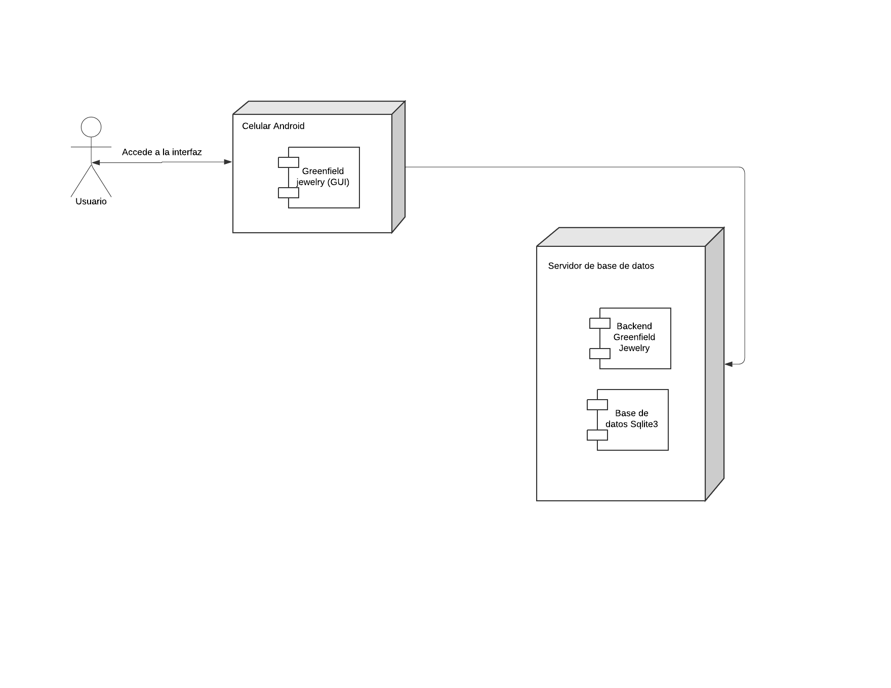

# Descripcion de entorno de desarrollo
---

## 1. Flutter SDK

Flutter es un framework de código abierto creado por Google que permite a los usuarios crear aplicaciones móviles nativas para iOS y Android.

### Proceso de instalación:

1. **Descargar Flutter SDK** (cualquier versión a partir de la 3.3.0):
   - Visita el sitio oficial de Flutter y descarga el SDK para tu sistema operativo.
   - Extrae el archivo descargado en la ubicación deseada (por ejemplo, `C:\src\flutter` en Windows).

   

2. **Configurar la Ruta**:
   - **En Windows**: Abre el "Panel de Control", ve a "Sistema y Seguridad" > "Sistema" > "Configuración avanzada del sistema". Haz clic en "Variables de entorno" y edita la variable PATH añadiendo la ruta donde extrajiste Flutter.
   - **En macOS y Linux**: Abre el terminal y añade la línea `export PATH="$PATH:[ruta a flutter]/bin"` al archivo `~/.bashrc`, `~/.zshrc`, o el que corresponda.

   

3. **Verificar Instalación**:
   - Ejecuta el siguiente comando: `flutter doctor --android-licenses` en la terminal para verificar la instalación y ver los componentes que faltan.
   - En caso ocurra un error en la descarga, ejecuta la siguiente línea: `git config --global --add safe.directory '*'`.

   

## 2. Android Studio

Android Studio es un entorno de desarrollo integrado (IDE) sencillo de utilizar para desarrollar aplicaciones en Flutter, especialmente en Android. Actúa como un lienzo donde se pueden visualizar los cambios realizados a través de Flutter.

### Proceso de instalación:

1. **Descargar Android Studio**:
   - Descarga Android Studio desde su sitio oficial.

   
   

2. **Instalar Android Studio**:
   - Sigue las instrucciones del instalador dependiendo de tu sistema operativo y asegúrate de incluir el Android SDK y el emulador durante la instalación.

   
   
   
   
   
   

3. **Configurar Android Studio**:
   - Abre Android Studio y ve a "Configuración" > "Plugins". Busca e instala el plugin de Flutter (esto instalará automáticamente el plugin de Dart).

   

4. **Configurar un Emulador de Android**:
   - En Android Studio, ve a "AVD Manager" y crea un nuevo dispositivo virtual (emulador) configurado según tus necesidades.

   

## 3. Visual Studio Code (VS Code)

VS Code es un editor de código fuente ligero y muy popular, ideal para desarrollar con Flutter. Es nuestra herramienta principal para interactuar con el código desarrollado en Flutter junto con Android Studio.

### Proceso de instalación:

1. **Descargar VS Code**:
   - Descarga VS Code desde su sitio oficial.

   

2. **Instalar Extensiones de Flutter y Dart**:
   - Abre VS Code y ve a "Extensiones". Busca e instala las extensiones de Flutter y Dart.

   
   

3. **Configurar Debugging**:
   - Abre la paleta de comandos (`Ctrl+Shift+P` o `Cmd+Shift+P` en macOS) y ejecuta el comando `Flutter: New Project` para crear un nuevo proyecto Flutter y asegurarte de que todo está configurado correctamente.

# Diagrama de despliegue
---

# Requerimientos No Funcionales
---

| **Identificación del requerimiento** | RNF 01 |
|--------------------------------------|---------|
| **Nombre del Requerimiento**         | Aplicación será desarrollada en Flutter SDK 3.24 |
| **Características**                  | El aplicativo se podrá modificar y desplegar en el framework Flutter con su respectiva compatibilidad con diversas herramientas y SO. |
| **Descripción del requerimiento**     | El ambiente de desarrollo es a través de Flutter por medio de un solo código base que se pueda desplegar en múltiples plataformas y que otorgue un rendimiento similar al nativo en cualquiera SO en la que se ejecute. |
| **Prioridad del requerimiento**       | Alta |

| **Identificación del requerimiento** | RNF 02 |
|--------------------------------------|---------|
| **Nombre del Requerimiento**         | La aplicación será diseñada bajo una paleta de colores |
| **Características**                  | La interfaz de la aplicación usará colores como verde, rojo y blanco. |
| **Descripción del requerimiento**     | El diseño de la interfaz de la aplicación será bajo los colores verde, rojo y blanco. Esto con la finalidad de que se adapte a la marca del producto. |
| **Prioridad del requerimiento**       | Baja |

| **Identificación del requerimiento** | RNF 03 |
|--------------------------------------|---------|
| **Nombre del Requerimiento**         | La aplicación se desplegará en Android |
| **Características**                  | El SO en la cual desplegamos y se mostrará compatibilidad de la  funciones del aplicativo es Android, sea tanto en su versión base como capas de personalización de fabricantes. |
| **Descripción del requerimiento**     | El área de despliegue y el desarrollo del código base al estar pensados para este SO, nos permite tener una integración mayor con los servicios derivados del ecosistema de Google y una mayor flexibilidad en la personalización de la app sin limitantes o restricciones de la misma tales como sí existe en iOS. |
| **Prioridad del requerimiento**       | Alta |

| **Identificación del requerimiento** | RNF 04 |
|--------------------------------------|---------|
| **Nombre del Requerimiento**         | El servidor se desplegará en Replit Server - Ruby |
| **Características**                  | Desarrollar y desplegar una aplicación en Replit Server utilizando Ruby, asegurando que sea segura, escalable y fácil de mantener. |
| **Descripción del requerimiento**     | La aplicación debe ser capaz de conectarse con la base de datos del replit server - Ruby de manera eficiente. Debe proporcionar logs para facilitar el monitoreo y la solución de problemas. |
| **Prioridad del requerimiento**       | Alta |

| **Identificación del requerimiento** | RNF 05 |
|--------------------------------------|---------|
| **Nombre del Requerimiento**         | La interfaz de la aplicación será visualmente moderna |
| **Características**                  | La interfaz será atractiva para los usuarios resultando así que sea fácil de navegar y acogedora para todo público. |
| **Descripción del requerimiento**     | La aplicación será fácil de navegar gracias a su diseño de la interfaz y cómoda visualmente para todo público para todas las edades. |
| **Prioridad del requerimiento**       | Alta |

| **Identificación del requerimiento** | RNF 06 |
|--------------------------------------|---------|
| **Nombre del Requerimiento**         | La aplicación debe ser capaz de procesar un catálogo de al menos 20 productos |
| **Características**                  | La interfaz que se proporciona al usuario proporciona la capacidad de contener y visualizar más de 20 productos sin fallas o interrupciones. |
| **Descripción del requerimiento**     | El apartado del aplicativo centrado en el catálogo permitirá una proyección y almacenamiento sin inconvenientes de los productos mayor a 20 items procurando mantener el rendimiento similar ante cualquier situación. |
| **Prioridad del requerimiento**       | Media |

| **Identificación del requerimiento** | RNF 07 |
|--------------------------------------|---------|
| **Nombre del Requerimiento**         | Ayuda en el uso del sistema |
| **Características**                  | La interfaz del usuario deberá de presentar un sistema de ayuda para que los mismos usuarios del sistema se les facilite el trabajo en cuanto al manejo del sistema. |
| **Descripción del requerimiento**     | La interfaz debe estar complementada con un buen sistema de ayuda (la administración puede recaer en personal con poca experiencia en el uso de aplicaciones informáticas). |
| **Prioridad del requerimiento**       | Alta |

| **Identificación del requerimiento** | RNF 08 |
|--------------------------------------|---------|
| **Nombre del Requerimiento**         | Mantenimiento |
| **Características**                  | El sistema deberá de tener un manual de instalación y manual de usuario para facilitar los mantenimientos que serán realizados por el administrador. |
| **Descripción del requerimiento**     | El sistema debe disponer de una documentación fácilmente actualizable que permita realizar operaciones de mantenimiento con el menor esfuerzo posible. |
| **Prioridad del requerimiento**       | Alta |

# Diagrama de casos de uso
---

# MOCKUP
---
## 1. Login y registro
  
-Este mockup muestra el flujo de login y registro de la aplicacion, comenzando con una pantalla de carga que presenta el logotipo de la marca. Luego, se incluyen pantallas para iniciar sesión, registrarse y recuperar la contraseña. Los usuarios pueden iniciar sesión o registrarse ingresando sus datos o utilizando Google. También se muestra el proceso de restablecimiento de contraseña y una pantalla de éxito tras completar el proceso.

## 2. Home y producto
  
-Este mockup muestra la pantalla de inicio y producto la aplicación. La pantalla principal incluye una sección de bienvenida y una lista de productos destacados, con opciones para buscar y explorar categorías como anillos, aretes y collares. En la vista del producto, se presenta una imagen con el nombre, precio y descripción detallada, junto con botones para añadir al carrito o comprar directamente. También se incluye una pantalla de "Acerca de nosotros" que muestra información sobre la marca y características destacadas de los productos.

## 3. Filter y categories
  
-Este mockup muestra la sección de filtros y categorías de la aplicación, donde los usuarios pueden explorar productos organizados por categorías como "Anillos", "Aretes", "Pulseras" y "Collares". También se presenta un filtro ajustable para seleccionar el rango de precios y ordenar los productos. Se incluyen vistas de las pantallas para cada categoría con imágenes de los productos, sus precios, y opciones de añadir al carrito. Además, se muestra una pantalla del carrito de compras, donde los usuarios pueden revisar sus productos antes de proceder al checkout, y una pantalla final que confirma el éxito de la compra con un mensaje de felicitación.

## 4. Mi perfil
  
-Este mockup muestra la sección de perfil de la aplicación, donde el usuario puede acceder a opciones como gestionar su información personal, revisar órdenes, administrar direcciones de envío y métodos de pago. También incluye una pantalla para ajustes de la cuenta y la opción de cerrar sesión. El diseño es claro y funcional, permitiendo al usuario navegar fácilmente entre las opciones de su perfil.

# Diagrama Relacional

  

