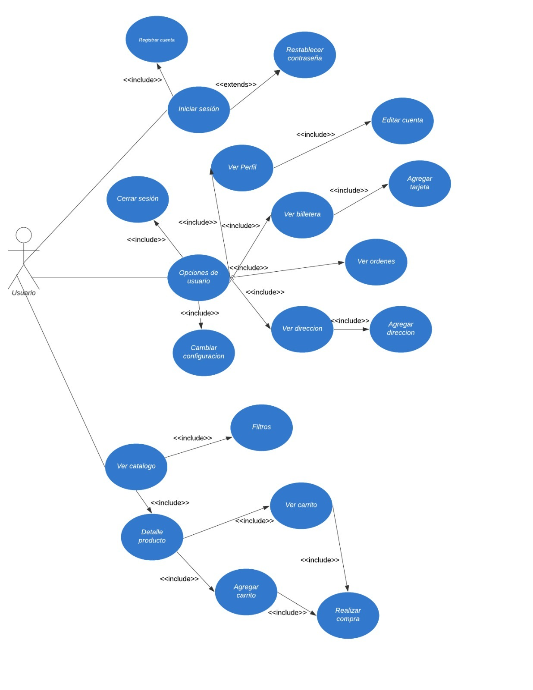
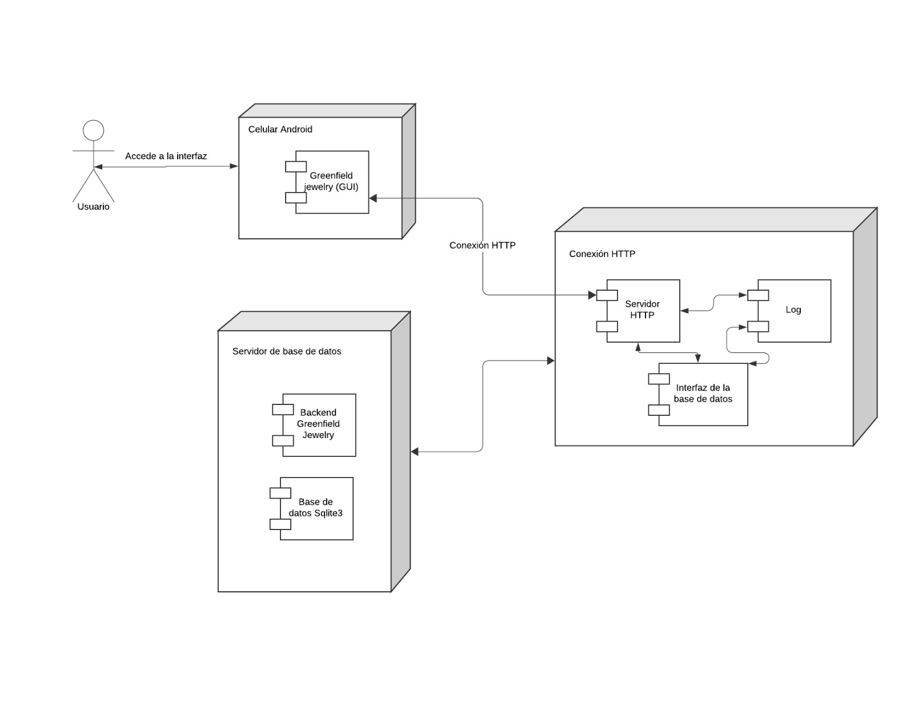
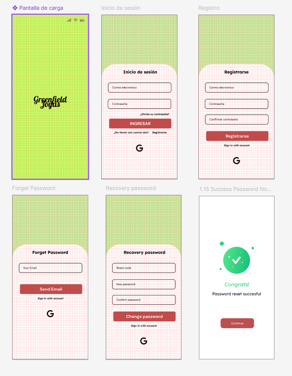
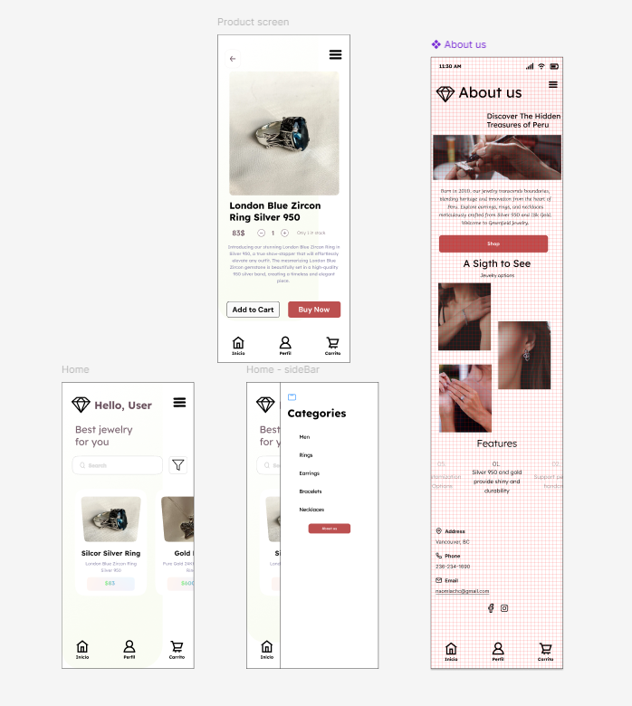
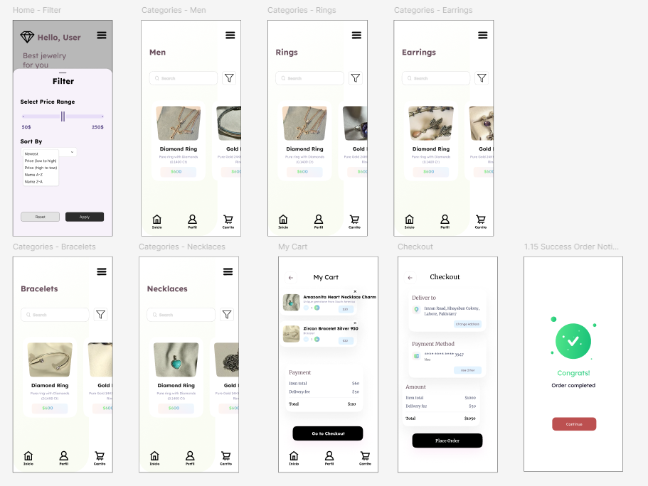
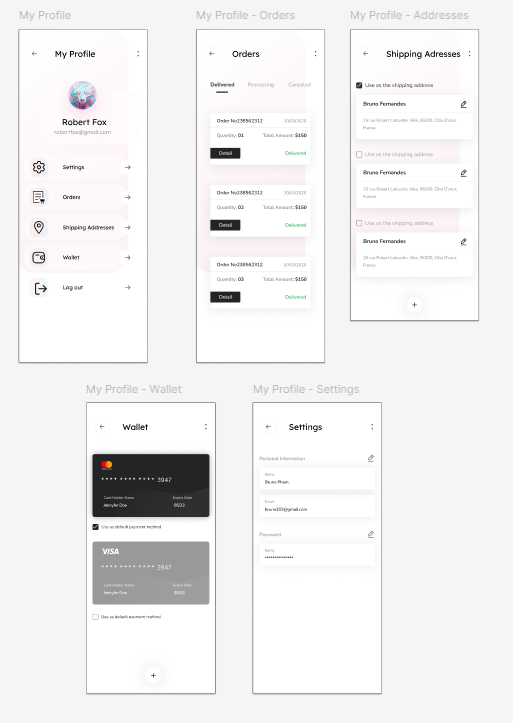

# Diagrama de casos de uso
---

# Diagrama de despliegue
---

# MOCKUP
---
## 1. Login y registro

## 1. Home y producto

## 1. Filter y categories

## 1. Mi perfil

# Descripcion de entorno de desarrollo
---

## 1. Flutter SDK

Flutter es un framework de código abierto creado por Google que permite a los usuarios crear aplicaciones móviles nativas para iOS y Android.

### Proceso de instalación:

1. **Descargar Flutter SDK** (cualquier versión a partir de la 3.3.0):
   - Visita el sitio oficial de Flutter y descarga el SDK para tu sistema operativo.
   - Extrae el archivo descargado en la ubicación deseada (por ejemplo, `C:\src\flutter` en Windows).

   

2. **Configurar la Ruta**:
   - **En Windows**: Abre el "Panel de Control", ve a "Sistema y Seguridad" > "Sistema" > "Configuración avanzada del sistema". Haz clic en "Variables de entorno" y edita la variable PATH añadiendo la ruta donde extrajiste Flutter.
   - **En macOS y Linux**: Abre el terminal y añade la línea `export PATH="$PATH:[ruta a flutter]/bin"` al archivo `~/.bashrc`, `~/.zshrc`, o el que corresponda.

   

3. **Verificar Instalación**:
   - Ejecuta el siguiente comando: `flutter doctor --android-licenses` en la terminal para verificar la instalación y ver los componentes que faltan.
   - En caso ocurra un error en la descarga, ejecuta la siguiente línea: `git config --global --add safe.directory '*'`.

   

## 2. Android Studio

Android Studio es un entorno de desarrollo integrado (IDE) sencillo de utilizar para desarrollar aplicaciones en Flutter, especialmente en Android. Actúa como un lienzo donde se pueden visualizar los cambios realizados a través de Flutter.

### Proceso de instalación:

1. **Descargar Android Studio**:
   - Descarga Android Studio desde su sitio oficial.

   
   

2. **Instalar Android Studio**:
   - Sigue las instrucciones del instalador dependiendo de tu sistema operativo y asegúrate de incluir el Android SDK y el emulador durante la instalación.

   
   
   
   
   
   

3. **Configurar Android Studio**:
   - Abre Android Studio y ve a "Configuración" > "Plugins". Busca e instala el plugin de Flutter (esto instalará automáticamente el plugin de Dart).

   

4. **Configurar un Emulador de Android**:
   - En Android Studio, ve a "AVD Manager" y crea un nuevo dispositivo virtual (emulador) configurado según tus necesidades.

   

## 3. Visual Studio Code (VS Code)

VS Code es un editor de código fuente ligero y muy popular, ideal para desarrollar con Flutter. Es nuestra herramienta principal para interactuar con el código desarrollado en Flutter junto con Android Studio.

### Proceso de instalación:

1. **Descargar VS Code**:
   - Descarga VS Code desde su sitio oficial.

   

2. **Instalar Extensiones de Flutter y Dart**:
   - Abre VS Code y ve a "Extensiones". Busca e instala las extensiones de Flutter y Dart.

   
   

3. **Configurar Debugging**:
   - Abre la paleta de comandos (`Ctrl+Shift+P` o `Cmd+Shift+P` en macOS) y ejecuta el comando `Flutter: New Project` para crear un nuevo proyecto Flutter y asegurarte de que todo está configurado correctamente.

# Requerimientos No Funcionales
---

| **Identificación del requerimiento** | RNF 01 |
|--------------------------------------|---------|
| **Nombre del Requerimiento**         | Aplicación será desarrollada en Flutter SDK 3.24 |
| **Características**                  | El usuario podrá acceder a la interfaz de mapa de rutas de las actividades de los itinerarios. |
| **Descripción del requerimiento**     | El usuario podrá visualizar las rutas de las actividades de los itinerarios que ha creado a través de un filtro. En ese filtro, se le pedirá en una casilla el nombre del itinerario en el que se quiere extraer la actividad y seguidamente en otra casilla, el nombre de la actividad que se quiere mostrar en el mapa. Después de colocar los datos necesarios, se contará con un botón de siguiente en el que se actualizará el mapa con la nueva actividad registrada. |
| **Prioridad del requerimiento**       | Alta |

| **Identificación del requerimiento** | RNF 02 |
|--------------------------------------|---------|
| **Nombre del Requerimiento**         | La aplicación será diseñada bajo una paleta de colores |
| **Características**                  | El usuario podrá acceder a la interfaz de mapa de rutas de las actividades de los itinerarios. |
| **Descripción del requerimiento**     | El usuario podrá visualizar las rutas de las actividades de los itinerarios que ha creado a través de un filtro. En ese filtro, se le pedirá en una casilla el nombre del itinerario en el que se quiere extraer la actividad y seguidamente en otra casilla, el nombre de la actividad que se quiere mostrar en el mapa. Después de colocar los datos necesarios, se contará con un botón de siguiente en el que se actualizará el mapa con la nueva actividad registrada. |
| **Prioridad del requerimiento**       | Alta |

| **Identificación del requerimiento** | RNF 03 |
|--------------------------------------|---------|
| **Nombre del Requerimiento**         | La aplicación se desplegará en Android |
| **Características**                  | El usuario podrá acceder a la interfaz de mapa de rutas de las actividades de los itinerarios. |
| **Descripción del requerimiento**     | El usuario podrá visualizar las rutas de las actividades de los itinerarios que ha creado a través de un filtro. En ese filtro, se le pedirá en una casilla el nombre del itinerario en el que se quiere extraer la actividad y seguidamente en otra casilla, el nombre de la actividad que se quiere mostrar en el mapa. Después de colocar los datos necesarios, se contará con un botón de siguiente en el que se actualizará el mapa con la nueva actividad registrada. |
| **Prioridad del requerimiento**       | Alta |

| **Identificación del requerimiento** | RNF 04 |
|--------------------------------------|---------|
| **Nombre del Requerimiento**         | El servidor se desplegará en Replit Server - Ruby |
| **Características**                  | El usuario podrá acceder a la interfaz de mapa de rutas de las actividades de los itinerarios. |
| **Descripción del requerimiento**     | El usuario podrá visualizar las rutas de las actividades de los itinerarios que ha creado a través de un filtro. En ese filtro, se le pedirá en una casilla el nombre del itinerario en el que se quiere extraer la actividad y seguidamente en otra casilla, el nombre de la actividad que se quiere mostrar en el mapa. Después de colocar los datos necesarios, se contará con un botón de siguiente en el que se actualizará el mapa con la nueva actividad registrada. |
| **Prioridad del requerimiento**       | Alta |

| **Identificación del requerimiento** | RNF 05 |
|--------------------------------------|---------|
| **Nombre del Requerimiento**         | La interfaz de la aplicación será visualmente moderna |
| **Características**                  | El usuario podrá acceder a la interfaz de mapa de rutas de las actividades de los itinerarios. |
| **Descripción del requerimiento**     | El usuario podrá visualizar las rutas de las actividades de los itinerarios que ha creado a través de un filtro. En ese filtro, se le pedirá en una casilla el nombre del itinerario en el que se quiere extraer la actividad y seguidamente en otra casilla, el nombre de la actividad que se quiere mostrar en el mapa. Después de colocar los datos necesarios, se contará con un botón de siguiente en el que se actualizará el mapa con la nueva actividad registrada. |
| **Prioridad del requerimiento**       | Alta |

| **Identificación del requerimiento** | RNF 06 |
|--------------------------------------|---------|
| **Nombre del Requerimiento**         | La aplicación debe ser capaz de procesar un catálogo de al menos 20 productos |
| **Características**                  | El usuario podrá acceder a la interfaz de mapa de rutas de las actividades de los itinerarios. |
| **Descripción del requerimiento**     | El usuario podrá visualizar las rutas de las actividades de los itinerarios que ha creado a través de un filtro. En ese filtro, se le pedirá en una casilla el nombre del itinerario en el que se quiere extraer la actividad y seguidamente en otra casilla, el nombre de la actividad que se quiere mostrar en el mapa. Después de colocar los datos necesarios, se contará con un botón de siguiente en el que se actualizará el mapa con la nueva actividad registrada. |
| **Prioridad del requerimiento**       | Alta |

| **Identificación del requerimiento** | RNF 07 |
|--------------------------------------|---------|
| **Nombre del Requerimiento**         | Ayuda en el uso del sistema |
| **Características**                  | La interfaz del usuario deberá de presentar un sistema de ayuda para que los mismos usuarios del sistema se les facilite el trabajo en cuanto al manejo del sistema. |
| **Descripción del requerimiento**     | La interfaz debe estar complementada con un buen sistema de ayuda (la administración puede recaer en personal con poca experiencia en el uso de aplicaciones informáticas). |
| **Prioridad del requerimiento**       | Alta |

| **Identificación del requerimiento** | RNF 08 |
|--------------------------------------|---------|
| **Nombre del Requerimiento**         | Mantenimiento |
| **Características**                  | El sistema deberá de tener un manual de instalación y manual de usuario para facilitar los mantenimientos que serán realizados por el administrador. |
| **Descripción del requerimiento**     | El sistema debe disponer de una documentación fácilmente actualizable que permita realizar operaciones de mantenimiento con el menor esfuerzo posible. |
| **Prioridad del requerimiento**       | Alta |
